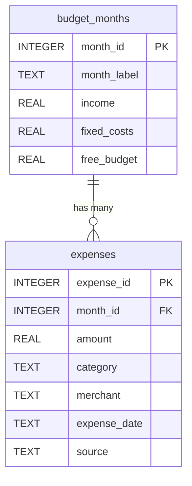

# Pennyguin

A mobile app that turns your monthly free spending money into the health bar of a small character. Every expense you log drains it, so you can feel how fast you are spending instead of finding out at the end of the month.

> Database class semester project, Fall 2026. iOS app built with React Native and Expo.
>
> **Check-in 1: Scope, Schema, and Strategy (Week 7)**

---

## Problem Definition and Mobile Scope

**The problem.** Most budgeting apps show lists and percentages that people ignore until the month is already over. Paying fixed bills first leaves a small pool of free money, and people have no intuitive sense of how fast they are draining it. A character whose health tracks that pool gives instant, memorable feedback on each purchase.

**How it works.** At the start of each month the user enters income and fixed costs (rent, bills, subscriptions).

- Free budget = income − fixed costs
- Health = (free budget − spent so far) / free budget

At zero the character faints, and a new month starts it fresh. The history shows how many months were healthy and how many were rough.

**Platform.** iOS mobile app built with React Native and Expo, demoed on the iOS Simulator.

**In scope this semester**

- Monthly setup: income, fixed costs, computed free budget
- Manual expense entry (amount, category, merchant, date)
- Health bar and character state computed from the database
- Month history with survived or fainted results

**Out of scope this semester**

- Bank or card syncing (the `source` column is reserved so email-alert import can be added after the class)
- Home-screen widgets, social features, leaderboards, and multiple characters
- Investment tracking and bill-splitting

The scope emphasizes tracking personal free spending against a monthly limit over building a full-featured finance manager.

## Initial Database Design and Mechanics

The design has two tables linked one-to-many: one budget month has many expenses, and each expense belongs to exactly one month.



| Table | Primary key | Foreign key | Purpose |
| --- | --- | --- | --- |
| `budget_months` | `month_id` | none | One row per month: income, fixed costs, free budget |
| `expenses` | `expense_id` | `month_id` → `budget_months(month_id)` | One row per logged purchase |

The foreign key stops an expense from pointing at a month that does not exist. Constraints keep bad data out at the database level: income and free budget must be positive, and every amount must be positive.

### Schema

```sql
PRAGMA foreign_keys = ON;

CREATE TABLE budget_months (
    month_id     INTEGER PRIMARY KEY,
    month_label  TEXT    NOT NULL UNIQUE,
    income       REAL    NOT NULL CHECK (income > 0),
    fixed_costs  REAL    NOT NULL CHECK (fixed_costs >= 0),
    free_budget  REAL    NOT NULL CHECK (free_budget > 0)
);

CREATE TABLE expenses (
    expense_id    INTEGER PRIMARY KEY,
    month_id      INTEGER NOT NULL,
    amount        REAL    NOT NULL CHECK (amount > 0),
    category      TEXT    NOT NULL,
    merchant      TEXT    NOT NULL,
    expense_date  TEXT    NOT NULL,
    source        TEXT    NOT NULL DEFAULT 'manual',
    FOREIGN KEY (month_id) REFERENCES budget_months(month_id)
);
```

### Sample data

Used in every query below.

```sql
INSERT INTO budget_months VALUES
 (1, '2026-08', 3200.00, 2100.00, 1100.00),
 (2, '2026-09', 3200.00, 2100.00, 1100.00),
 (3, '2026-10', 3200.00, 2150.00, 1050.00),
 (4, '2026-11', 3200.00, 2150.00, 1050.00);

INSERT INTO expenses VALUES
 (1,  1, 62.40,  'Groceries', 'Dillons',         '2026-08-03', 'manual'),
 (2,  1, 14.25,  'Dining',    'Chipotle',        '2026-08-05', 'manual'),
 (3,  1, 48.00,  'Gas',       'QuikTrip',        '2026-08-09', 'manual'),
 (4,  1, 120.00, 'Fun',       'Concert Tickets', '2026-08-15', 'manual'),
 (5,  2, 75.10,  'Groceries', 'Dillons',         '2026-09-02', 'manual'),
 (6,  2, 22.80,  'Dining',    'Chipotle',        '2026-09-06', 'manual'),
 (7,  2, 54.30,  'Dining',    'Olive Garden',    '2026-09-12', 'manual'),
 (8,  2, 41.00,  'Gas',       'QuikTrip',        '2026-09-18', 'manual'),
 (9,  3, 88.65,  'Groceries', 'Walmart',         '2026-10-01', 'manual'),
 (10, 3, 9.50,   'Dining',    'Starbucks',       '2026-10-02', 'manual'),
 (11, 3, 35.00,  'Fun',       'Movie Theater',   '2026-10-03', 'manual');
```

### How the core feature runs

The health bar is never stored. It is computed from the two tables whenever the screen loads:

```sql
SELECT b.month_label, b.free_budget,
       COALESCE(SUM(e.amount), 0) AS spent,
       ROUND(100.0 * (b.free_budget - COALESCE(SUM(e.amount), 0))
             / b.free_budget, 1) AS health_pct
FROM budget_months b
LEFT JOIN expenses e ON e.month_id = b.month_id
GROUP BY b.month_id;
```

On the sample data this returns 77.8% for 2026-08, 82.4% for 2026-09, 87.3% for 2026-10, and 100.0% for 2026-11, which has no expenses yet. The `LEFT JOIN` is what keeps that empty month in the result.

### Deliberate design choices

`category` and `merchant` are plain text in `expenses` for now. That repetition ("Dillons" appears twice, "Dining" four times) is a known weakness that I plan to resolve with normalization in Check-in 2. The `source` column defaults to `'manual'` so automatic import can be added later without changing the schema.

## Five Relational Algebra Queries

Each query supports a screen or check in the app. Every SQL statement was run against the sample data above, and the results shown are the actual output.

### Query 1: Large purchases (selection)

Supports a "big spends" filter on the expense list.

```math
\sigma_{amount > 50}(\mathrm{expenses})
```

```sql
SELECT * FROM expenses WHERE amount > 50;
```

Result: 5 rows (`expense_id` 1, 4, 5, 7, 9).

### Query 2: Spending categories in use (projection)

Supports the category picker and category totals.

```math
\pi_{category}(\mathrm{expenses})
```

```sql
SELECT DISTINCT category FROM expenses;
```

Result: Groceries, Dining, Gas, Fun. Relational algebra removes duplicates automatically because relations are sets, while SQL needs `DISTINCT` to do the same.

### Query 3: Every expense with its month (join)

Supports the expense list grouped by month, and shows the foreign key link in action.

```math
\pi_{expense\_id,\ month\_label,\ merchant,\ amount}\big(\mathrm{expenses} \bowtie_{expenses.month\_id = budget\_months.month\_id} \mathrm{budget\_months}\big)
```

```sql
SELECT e.expense_id, b.month_label, e.merchant, e.amount
FROM expenses e
JOIN budget_months b ON e.month_id = b.month_id;
```

Result: 11 rows, one per expense, each labeled with its month.

### Query 4: September dining spend (join plus selection)

Supports drilling into one category for one month from the history screen.

```math
\pi_{month\_label,\ merchant,\ amount}\Big(\sigma_{category = \text{Dining} \wedge month\_label = \text{2026-09}}\big(\mathrm{expenses} \bowtie \mathrm{budget\_months}\big)\Big)
```

```sql
SELECT b.month_label, e.merchant, e.amount
FROM expenses e
JOIN budget_months b ON e.month_id = b.month_id
WHERE e.category = 'Dining' AND b.month_label = '2026-09';
```

Result: Chipotle 22.80 and Olive Garden 54.30.

### Query 5: Months with no expenses yet (set difference)

Supports showing a brand-new month at full health, and detecting months where nothing has been logged.

```math
\pi_{month\_id}(\mathrm{budget\_months}) - \pi_{month\_id}(\mathrm{expenses})
```

```sql
SELECT month_id FROM budget_months
EXCEPT
SELECT month_id FROM expenses;
```

Result: `month_id` 4 (2026-11), the only month with no expenses.

### Integrity check

The foreign key rejects an expense for a month that does not exist:

```sql
INSERT INTO expenses VALUES (99, 42, 5, 'Fun', 'X', '2026-10-04', 'manual');
-- Error: FOREIGN KEY constraint failed
```

## AI Utilization Plan

AI is used as a tutor and reviewer, not as the author of the schema or queries. The rule for every session: attempt the work first, then ask AI to explain, critique, or help diagnose, and run and verify everything myself.

### Agents and their roles

| Agent | Used for | Not used for |
| --- | --- | --- |
| Claude (chat) | Explaining relational algebra and normalization concepts, checking my reasoning, quizzing me, explaining SQL errors | Writing my schema, relational algebra answers, or reflection write-ups |
| Claude Code | Scaffolding the Expo project, reviewing my ORM code, and showing the SQL my ORM generates when I debug it | Generating the database layer or app logic before I have designed it myself |

### Working rules

1. Write my own attempt first and paste it into the prompt, so the AI reacts to my thinking.
2. Ask for hints and explanations before answers. If I get an answer, rewrite it in my own words and test it.
3. Run every SQL statement against the real sample data and compare the output with what I expected by hand.
4. Keep a short AI log for each check-in: the prompt, what I learned, and what I changed.
5. When the ORM misbehaves later in the project, look at the generated SQL myself before asking for help.

### Example prompts

**Learning relational algebra**

- "I wrote π_category(expenses) and my SQL needs DISTINCT, but I thought projection already removes duplicates. Explain why relational algebra and SQL differ here, and quiz me with two similar cases."
- "Here is my set difference for months with no expenses: [my expression]. Don't rewrite it. Tell me whether it is correct and what each side of the minus returns."

**Diagnosing SQL friction**

- "My query returns no row for a month with zero expenses. Here is the query and the sample data. Don't give me the fix. Give me three questions that would lead me to find the problem."
- "SQLite didn't reject an expense for month_id 42. Here is my schema. What should I check about how foreign keys are enforced?"

**Checking my design**

- "Here is my two-table design and why I chose it. Play a skeptical instructor and list the questions you would ask about my keys and constraints, without answering them."
- "I stored free_budget in budget_months but I can also compute it from income and fixed_costs. What are the trade-offs? I'll decide and explain my choice."

### How this builds self-reliance

Each prompt asks for an explanation, a question, or a critique of my own work. By the end of the project I should be able to walk through functional dependencies and normalization without AI, and read ORM-generated SQL on my own. The AI log shows where I used help and what I learned from it.
